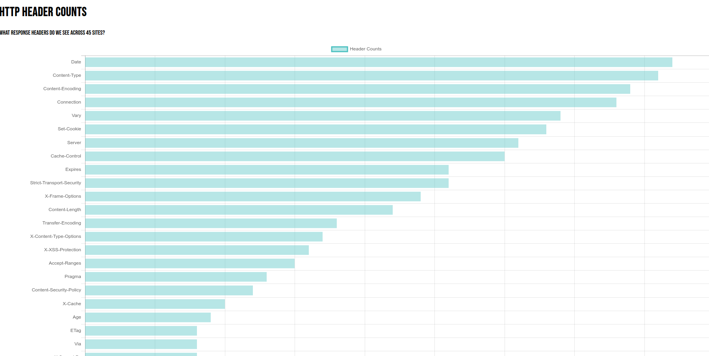
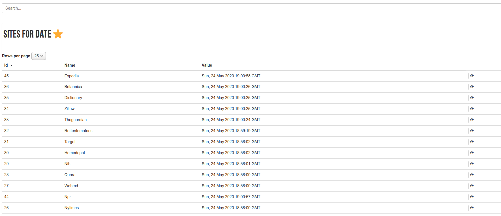
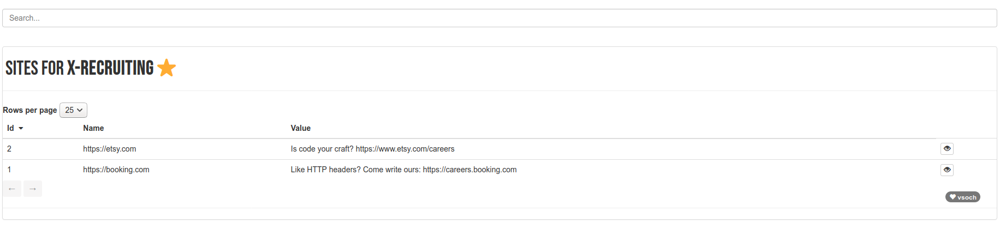

# URL Headers

What kind of headers are hiding amonst our favorite websites? Inspired by
[this post](https://frenxi.com/http-headers-you-dont-expect/) I decided to
do a quick project to explore this space. This is messy and quick, and I want
to test generating a basic flask app, and then parsing it's index
to get and save static versions of all it's pages for GitHub pages.

## Quick Start

You can generate the data locally and then export the interface to static files.

```bash
pip install -r requirements.txt
python data/run.py

# build and run the container
docker build -t vanessa/headers .
docker run --rm -it -p 5000:5000 vanessa/headers

# Parse the data at port 5000
python data/parse.py
```

After you parse, you'll need to copy static files.

```bash
cp -R app/static/ docs/static
```

If you have the flask dependencies installed locally, you can also just do:

```bash
python app/__init__.py
```

What I wound up doing is using the included GitHub action to generate the data
on GitHub actions (and not my local machine), save as artifact, and then generated
an interface from that. It's up to you! To use the action, you can specify
this repository (a branch or preferably a release) and then
a path to some custom urls.txt files to include. For example:

```bash
name: parse-headers

on:
  pull_request: []

jobs:
  parsing-headers:
    name: Parse Headers
    runs-on: ubuntu-latest
    steps:
      - name: Checkout Repository
        uses: actions/checkout@v2
      - name: Generate Data for Interface
        uses: researchapps/url-headers@master
        with:
          urls: data/urls.txt
      - name: Upload data as artifact
        uses: actions/upload-artifact@v2-preview
        with:
          name: headers-data
          path: data/*.json
```

See [examples](examples) for this file. More verbose details are below.

## 1. Parse Data

I first started writing a simple script to get headers for 45 sites that are fairly popular,
but ultimately found a list of [500 sites](https://moz.com/top500) to use instead.
I had to edit the list extensively, as many urls no longer existed, or needed to have
a www. prefix to work, period. I also removed urls that didn't have a secure connection.
This gave me a total of 500 urls (I added a few to get a nice even number!)
represented in [data/urls.txt](data/urls.txt). From those sites, I found 615 unique headers, 
ranging in frequency from being present in all sites (Content-Type, N=500) to only being
present for one site (N=1). The most frequent was "Content-Type," followed by Date.
 I did this with [data/run.py](data/run.py). I also separately parsed cookies, keeping the names
but removing values in the case that they had any kind of personal information or could
otherwise be used maliciously. I found a total of 457 unique cookies across the 500 sites.

## 2. Flask Application

I decided to use [Flask](https://flask.palletsprojects.com/en/1.1.x/) and 
[ChartJS](https://www.chartjs.org/) because they are both relatively
easy, and although I've recently tried other charting Python libraries,
for the most part they have been annoying and error prone. From this I was able
to create a main view to show all counts:



Each page has a simple view that shows the values for headers:



Yeah, the Date header isn't hugely interesting, other than capturing the date
when I made the request! More interesting is the `X-Recruiting` header, which
I only found present for etsy:



To run this locally you can do:

```bash
$ python app/__init__.py 
 * Serving Flask app "__init__" (lazy loading)
 * Environment: production
   WARNING: This is a development server. Do not use it in a production deployment.
   Use a production WSGI server instead.
 * Debug mode: on
 * Running on http://127.0.0.1:5000/ (Press CTRL+C to quit)
 * Restarting with stat
 * Debugger is active!
 * Debugger PIN: 261-026-821
```

## 3. Dockerize

To be fair, I did develop this locally, but my preference is create a Dockerized
version so if/when someone finds it in a few years, they can hopefully
reproduce it slightly better than if the Dockerfile wasn't provided. To
build the image:

```bash
docker build -t vanessa/headers .
```

And then run it, exposing port 5000:

```bash
docker run --rm -it -p 5000:5000 vanessa/headers
```

And you can open to the same [http://localhost:5000] to see the site.
Remember for the above you already need to have generated the output data in
your [data](data) folder. You can do this either by shelling into the container
interactively, or just on the host.

```bash
$ python data/run.py
``

And then once your server is running, you can use the parsing script to scrape it.
The default will be output to docs in your present working directory.

```bash
$ mkdir -p docs
$ python data/parse.py
```

## 4. Parse Pages

My final goal is to generate completely static files for all views of the app.
Why do we want to do this? To share on GitHub pages, of course! I wrote
a rather ugly, spagetti-esche script, [data/parse.py](data/parse.py)
that (given a running server) will extract pages for the cookies, headers,
and base sites, and then save them to a static folder [docs](docs).
I then took this a step further and starting working on a custom GitHub action, 
but fell short because I needed to start a service container (as the action)
and starting the service during the run didn't work.

## 5. Investigation

Finally, I wanted to spend a few minutes looking into some of the things that I
noticed. Instead of writing this here, I'll write it up in a blog post.

## GitHub Action

I first attempted to make a more complex GitHub action to parse the data,
start the web service, and then parse (and download the static files),
but since this would require [a service container](https://help.github.com/en/actions/reference/workflow-syntax-for-github-actions#jobsjob_idservices) and it needed to be running at the onset of 
the job, I had a sort of catch-22 that I wasn't able to get around. Instead,
I created the GitHub action to simply parse and generate the original
data, and then save as an artifact. I could then download it and run
the service and parser locally, which seemed like a reasonable thing to do.
